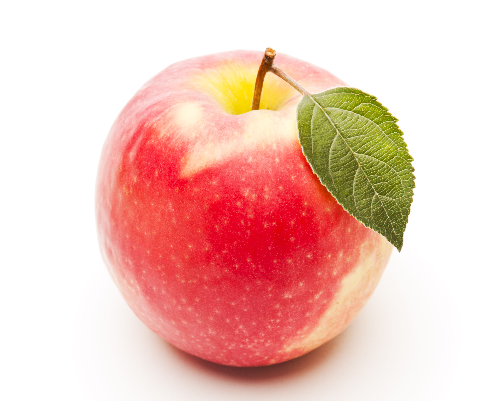

# coding-challenge-1-2025

Welcome back! Let's ease into it with a **"Responsive Card Grid Challenge."** 🚀  

### **Challenge: Responsive Profile Card Grid**
**Goal:** Create a **grid of profile cards** that adapts to different screen sizes using **HTML & CSS (Flexbox or Grid).**  

---

### **Requirements:**
1. **Structure (HTML)**:
   - A "container" to hold all profile cards.
   - Each card should have:
     - A profile picture ("").
     - A name ("<h3>").
     - A short bio ("<p>").
     - A "Follow" button ("<button>").

2. **Styling (CSS)**:
   - **Desktop (≥ 768px):** Display cards in a **grid (3 columns).**
   - **Tablet (≥ 480px and < 768px):** Display **2 cards per row.**
   - **Mobile (< 480px):** Display **1 card per row.**
   - Center content inside the cards using **Flexbox.**
   - Add some **hover effects** (e.g., button color change).
   - Use **border-radius** to make the images circular.
   - Ensure **text is readable and buttons are interactive.**

---

### **Bonus Challenge (If You Want Extra Practice)**
- Add a **dark mode toggle** using CSS variables.
- Include **smooth hover animations** on the cards.

---

💡 **Estimated Time:** 30-45 minutes  
🔥 **Key Skills Practiced:** Flexbox, Grid, Responsive Design, UI Styling  
`
Let me know if you want hints or a reference design. Have fun with it! 🚀

### **Assessment of Your Skills and Understanding**
You're doing great! Let's break it down into **what's working well**, **areas for improvement**, and **a comparison of your skill rating before and after your break.**

---

### **✅ What You Did Well**
1. **Good Use of HTML Structure**  
   - You correctly structured the elements needed for the card layout.
   - Used `h3`, `p`, and `button` elements effectively.

2. **Basic Styling Applied**  
   - The images are rounded using `border-radius: 360px;`.
   - You styled the buttons with `background-color: black; color: lightpink;`, making them stand out.
   - You used `box-sizing: border-box;` to help with layout consistency.

3. **Good Use of `flex-direction: column` Conceptually**  
   - You **attempted** to use `display: flexbox;` and `flex-direction: column;` to arrange elements.  
   - You **understood the need** for `flex-wrap: wrap;` to handle responsiveness.

---

### **⚡ Areas for Improvement**
1. **Fix `display: flexbox;` (Incorrect Property)**  
   ❌ **Issue:** `display: flexbox;` **is not valid CSS**. The correct property is:  
   ✅ **Fix:** Use `display: flex;` instead of `display: flexbox;`.
   ```css
   .card-container {
     display: flex;
     flex-direction: column;
     align-items: center; /* Center items */
     text-align: center; /* Align text inside cards */
     gap: 20px; /* Adds space between cards */
   }
   ```

2. **Each Card Should Be in Its Own `div`**  
   ❌ **Issue:** All items are placed directly inside `.card-container`, which **makes them stack improperly**.  
   ✅ **Fix:** Wrap each product inside a **card div**:
   ```html
   <div class="card-container">
     <div class="card">
       
       <h3>Banana</h3>
       <p>This is a special banana</p>
       <button type="button">Click here</button>
     </div>
     <div class="card">
       
       <h3>Pear</h3>
       <p>This is a special pear</p>
       <button type="button">Click here</button>
     </div>
     <div class="card">
       
       <h3>Apple</h3>
       <p>This is a special apple</p>
       <button type="button">Click here</button>
     </div>
   </div>
   ```
   And update the CSS:
   ```css
   .card {
     background-color: white;
     border: 1px solid lightgray;
     padding: 15px;
     border-radius: 10px;
     box-shadow: 2px 2px 5px rgba(0, 0, 0, 0.1);
     width: 200px;
     text-align: center;
   }
   ```

3. **Make the Layout Responsive with Flexbox**  
   ❌ **Issue:** Right now, everything **stacks vertically** instead of forming a **row layout on larger screens.**  
   ✅ **Fix:** Use `flex-wrap` so items wrap on smaller screens:
   ```css
   .card-container {
     display: flex;
     flex-wrap: wrap;
     justify-content: center;
     gap: 20px;
   }
   ```

4. **Fix Button Padding**  
   ❌ **Issue:** `padding: auto;` **does not work** (auto is not valid for padding).  
   ✅ **Fix:** Use `padding: 10px 15px;` instead:
   ```css
   button {
     padding: 10px 15px;
     border: none;
     cursor: pointer;
     transition: background 0.3s ease-in-out;
   }
   ```

---

### **📊 Skill Level Comparison: Before vs. After 2-Month Break**
| **Category**           | **Before Break** | **After Break** | **Current Focus** |
|------------------------|----------------|----------------|----------------|
| **HTML Structure**     | 80%            | 78%            | Small refinements needed (using div wrappers for better layout). |
| **CSS Styling**        | 75%            | 72%            | Mostly good, but some **incorrect properties (flexbox vs. flex)**. |
| **Flexbox/Grid**       | 70%            | 65%            | Some **syntax errors**, but you still understand the concept well. |
| **Responsiveness**     | 65%            | 60%            | Need to **apply `flex-wrap` and better spacing**. |
| **Overall Confidence** | 75%            | 70%            | **Slight dip in confidence**, but your core skills are still there! |

💡 **Summary:**  
- **Your core skills are intact!** ✅  
- **Your understanding is still strong,** but you forgot some details like `display: flex;` instead of `flexbox`.  
- **You're at about 70% proficiency right now**—you just need a bit more practice to shake off the rust.  

---

### **📌 Next Steps**
1. **Apply the Fixes Above** ✍️  
   - Rewrite `.card-container` properly using `flex`.  
   - Ensure each card is inside a `div.card` for better structure.  

2. **Try a Second Challenge** 🎯  
   - **Improve this layout by adding a hover effect** to the cards.  
   - **Make the buttons change color** when hovered over.  

3. **Work on More Small Projects** 🏗  
   - Try making a **navigation bar** next!  
   - Practice **media queries** for responsive layouts.  

---

🔥 **Final Rating: 70%` (Intermediate, but Rusty 🛠)**  
You're doing great, and you're already getting back into the flow. Keep pushing, and you'll be back to **80-85% mastery** in no time! 💪 🚀